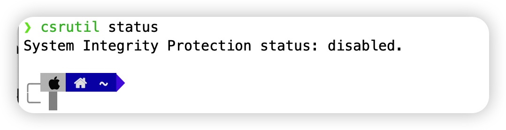

## 吾爱破解围观破解过程

[macOS 逆向区](https://www.52pojie.cn/forum.php?mod=forumdisplay&fid=5&filter=typeid&typeid=377)

用户: QiuChenly

老天天有人说看不懂怎么用有没有成品。

声明: 
本项目仅交流学习软件安全技术使用，不会发布任何形式的成品，也没有任何聊天群和组织，更不会收取任何人一分钱，各位谨防受骗。
不要将本项目研究成果进行传播破坏软件公司的利益，所有法律责任由传播者独自承担，作者从未为任何破解软件传播组织提供过任何形式的技术支持，不支持不赞同不理解传播盗版软件这种违法行为。
因使用者传播者传播破解软件导致的任何法律责任与包括但不仅限于引起系统故障 财产损失等问题作者概不负责。

还要成品，嫌哥们4⃣️的不够快是吧😓。

这里重新用中文写一份使用方法:

0.首先关闭SIP!!!
SIP全名叫System Integrated Protection,是Apple的天才设计。
如果你在终端输入csrutil status显示如下:

显示Disabled说明关闭了SIP，如果是enable就是默认开启了，如果你想体验正版，必须关闭他。怎么关闭？百度搜一下如何关闭Mac电脑SIP。
M1/M2机器使用需要在应用详情中勾选"Rosetta 运行"才可以正常注入。

1.下载Tools里面的两个文件: insert_dylib libInlineInjectPlugin.dylib

insert_dylib是一个注入工具，将体验代码注入到目标程序中。
如果你```sudo insert_dylib```无法执行，请给文件加上可执行权限:
    ```sudo chmod +x insert_dylib```

2.**libInlineInjectPlugin.dylib**这个文件不可以被删除或移动到任意位置，因为他的路径被记录在目标App的读取路径中。但是你把它放到.app文件内，这样可以和App一起携带走。

3.复制一份下面Tips指南中提到的文件。

如copy /Applications/OmniRecorder.app/Contents/MacOS/OmniRecorder to ‘/Applications/OmniRecorder.app/Contents/MacOS/OmniRecorder_副本’

就是让你把‘OmniRecorder’这个文件复制一份为‘OmniRecorder_副本’。

4.执行注入

```bash
sudo insert_dylib文件全路径 libInlineInjectPlugin.dylib文件的全路径 /Applications/OmniRecorder.app/Contents/MacOS/OmniRecorder_副本 /Applications/OmniRecorder.app/Contents/MacOS/OmniRecorder
```

5.结束。

切记不要激活后就把libInlineInjectPlugin.dylib文件给移动位置或者删除，实际注入还是需要他！！！

最后，附简单使用的懒人傻瓜式脚本，👉 [一键自动化的简单操作说明](./Shells/README.md)。