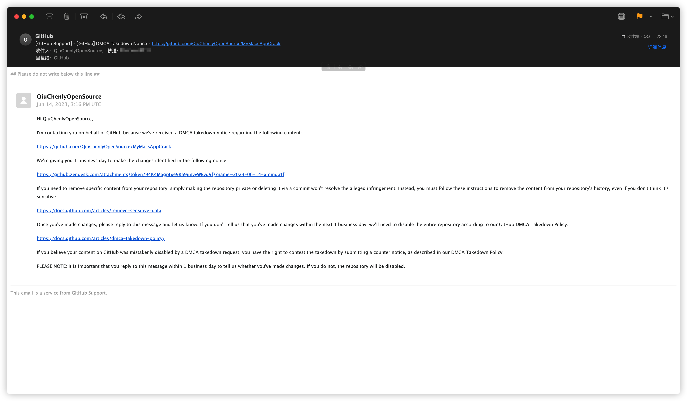

# Xmind 我TM跟你没完
# 本项目源代码在此，敬请审查：https://github.com/QiuChenlyOpenSource/macOS-InjectPluginCode
# 要是有一行代码跟你有关，我叫你爹，要是一行代码跟你无关，你叫我爹，OK？
# 我这个仓库有什么文件跟你有关？
# 马上反手举报你乱举报我
# 如果你坚持，COMEON，I AM HERE。



```

Dear QiuChenlyOpenSource
Jun 14, 2023, 3:16 PM UTC

Hi QiuChenlyOpenSource,

I'm contacting you on behalf of GitHub because we've received a DMCA takedown notice regarding the following content:

https://github.com/QiuChenlyOpenSource/MyMacsAppCrack

We're giving you 1 business day to make the changes identified in the following notice:

https://github.zendesk.com/attachments/token/94K4Magptxe9Ra9jmvyWBvd9f/?name=2023-06-14-xmind.rtf

If you need to remove specific content from your repository, simply making the repository private or deleting it via a commit won't resolve the alleged infringement. Instead, you must follow these instructions to remove the content from your repository's history, even if you don't think it's sensitive:

https://docs.github.com/articles/remove-sensitive-data

Once you've made changes, please reply to this message and let us know. If you don't tell us that you've made changes within the next 1 business day, we'll need to disable the entire repository according to our GitHub DMCA Takedown Policy:

https://docs.github.com/articles/dmca-takedown-policy/

If you believe your content on GitHub was mistakenly disabled by a DMCA takedown request, you have the right to contest the takedown by submitting a counter notice, as described in our DMCA Takedown Policy.

PLEASE NOTE: It is important that you reply to this message within 1 business day to tell us whether you've made changes. If you do not, the repository will be disabled.
```
