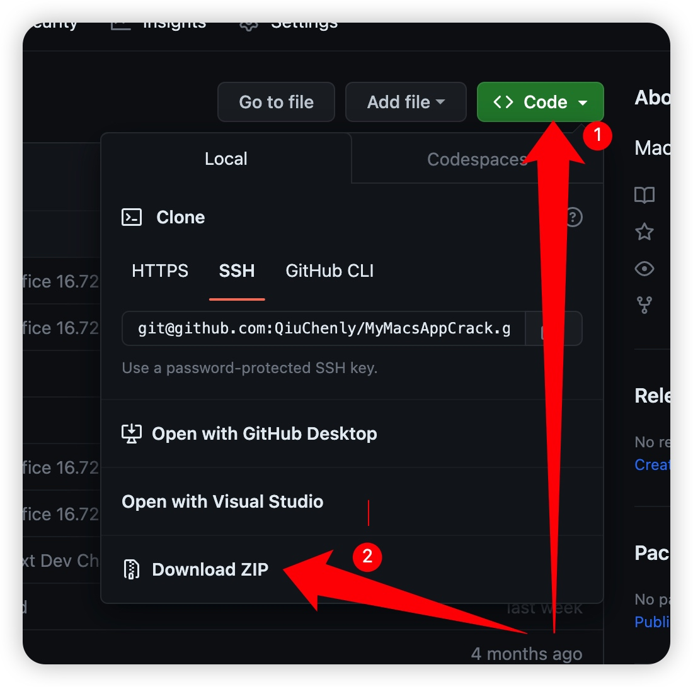
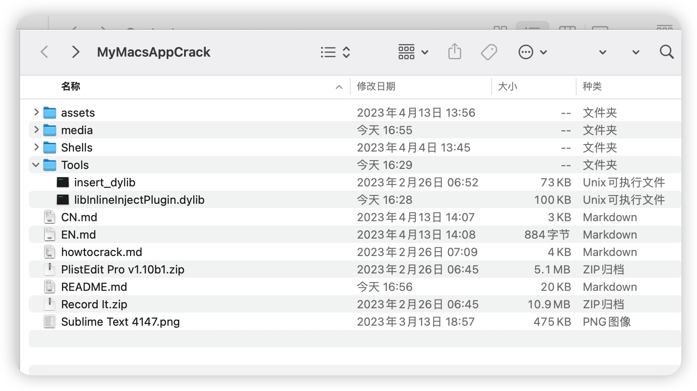
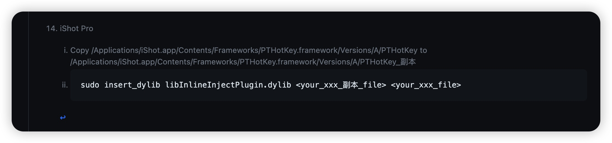
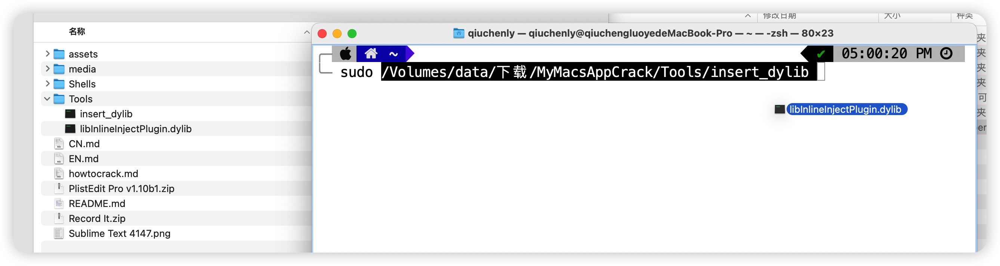
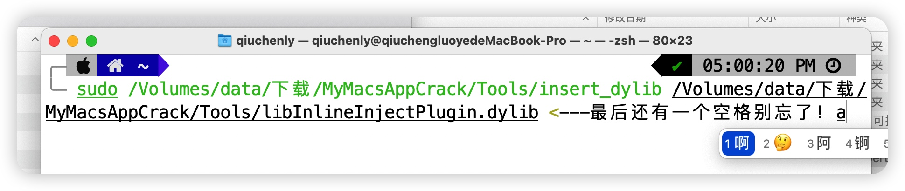
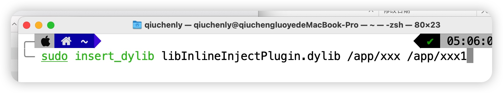
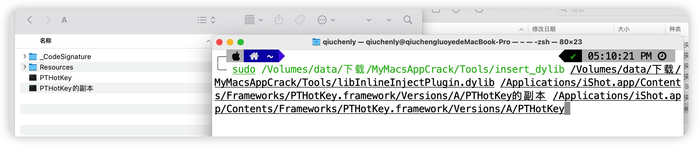

# <p align="center">macOS Apps Inject Plugin</p>

<p align="center">K'ed By QiuChenly(秋城落叶)</p>
<p align="center">为我的Mac独奏MVP凯歌</p>
<p align="center">Powered By 青海摇</p>
<p align="center">更新日期 2023.05.04</p>
<p align="center"><a href="https://github.com/QiuChenly/MyMacsAppCrack/blob/main/CN.md">中文</a> | <a href="https://github.com/QiuChenly/MyMacsAppCrack/blob/main/EN.md">English</a></p>

### <p align="center">查询作者的成分</p>
女权主义者，爱狗人士，高技术力舔狗。

b站抽象小鬼，烂梗之王，话题终结者。

贴吧黄牌老东西，v8元老，孙笑川吧老东西。

柯洁铁粉，七海娜娜米结晶人，冬雪莲男友粉，Otto棍孝子。

火星包包孝子，引流之主EQQR炮车没🐎。

青海社会摇2023代传人，但是不穿豆豆鞋紧身衣。

西安摇强劲对手，苏南张诗尧，青海摇集大成者。

U R B B R,G R O U GAY!

### <p align="center">点击上方的中文/英文查看具体使用方法,或者翻到最下面查看说明</p>

&nbsp;&nbsp;每次github文件更新后要及时下载更新, 我希望看到的是大家愉快的使用我的智慧成果而不是有小可爱拿旧版本文件问我为什么激活不了新版本，那我倒是要问问你，为什么不下载新的补丁文件？

&nbsp;&nbsp;然后还有Dinner加群专门问我为什么不能激活新版本的App，你拿着清朝的剑斩本朝的官我都懒得喷你了。

&nbsp;&nbsp;都用破解软件了连SIP都不会关的dinner滚一边，有不要脸还来问我SIP怎么关的我上来就骂。你可以不知道怎么关但是连百度都不会用那确实低能，这种人我建议你别用macOS了，你不适合用电脑。

# <center>注入补丁支持的App列表一览 </center>

数字上标可点击查看注入方法 下载链接点击会跳转到官方下载链接

| App名称                                             | 支持的版本             | 下载链接                                                                                                          |破解原因|
|-----------------------------------------------------|---------------------|-----------------------------------------------------------------------------------------------------------------|-----------------------------------------------------------------------------------------------------------------|
| Omi 录屏专家[^omi_recording_pro]                    | v1.2.4(2023020802)  | MacAppStore                                                                                                      |随便破破|
| Omi NTFS 磁盘专家 Pro[^omi_ntfs]                    | v1.2.3 (2023020701) | [官方下载链接](https://cdn.zh.okaapps.com/resource/download/NTFS-Pro-Installer.pkg)                       |随便破破|
| Fig Player[^fig_player]                             | v1.2.3(2023032401)  | MacAppStore                                                                                                      |随便破破|
| Bandizip365[^bandizip365]                           | v7.22               | [MacAppStore](https://apps.apple.com/cn/app/bandizip-365-%E5%8E%8B%E7%BC%A9%E5%92%8C%E8%A7%A3%E5%8E%8B%E7%BC%A9/id1596426184?mt=12)                                                                                                      |随便破破|
| Macs Fan Control[^macs_fan_control]                 | v1.5.15             | [官方下载链接](https://crystalidea.com/downloads/macsfancontrol.zip)                                      |随便破破|
| Record it Pro[^record_it_pro]                       | v1.7.6              | MacAppStore                                                                                                        |随便破破|
| PlistEdit Pro[^plistedit_pro]                       | v1.10b1             | Here                                                                                                            |随便破破|
| Sublime Text Dev[^sublimetext]                      | v4148               | [官方下载链接](https://download.sublimetext.com/sublime_text_build_4148_mac.zip)                          |随便破破|
| CleanMyMac X[^cmm]                               | v4.13.2           | [官方下载链接](https://dl.devmate.com/com.macpaw.CleanMyMac4/CleanMyMacX.dmg)                             |随便破破|
| App Cleaner & Uninstaller[^app_cleaner_uninstaller] | v8.1.2                | [官方下载链接](https://download.nektony.com/download/app-cleaner-uninstaller/app-cleaner-uninstaller.dmg) |随便破破|
| PopClip[^popclip]                                   | v2022.12            | [官方下载链接](https://pilotmoon.com/downloads/PopClip-2022.12.zip)                                       |随便破破|
| MWeb Pro[^mwebpro]                                  | v4.4.4 - 直接通杀后续版本             | [官方下载链接](https://mweb-1256924220.cos.accelerate.myqcloud.com/MWebPro441.dmg)                        |随便破破|
| Ulysses[^ulysses]                                   | v29.4               | MacAppStore                                                                                                      |随便破破|
| iShot[^ishot]                                       | v2.3.3              | MacAppStore                                                                                                      |国产App之光，谨此致敬🫡|
| AutoSwitchInput[^autoswitch]                        | v2.2.1              | MacAppStore                                                                                                      |随便破破|
| SuperRightKey[^irightmouse]                         | v2.2.3              | MacAppStore                                                                                                      |随便破破|
| 解优2[^bestzip2]                         | v1.6.1              | [MacAppStore](https://apps.apple.com/cn/app/%E8%A7%A3%E4%BC%98-%E4%B8%93%E4%B8%9A%E7%9A%84-rar-7z-zip-%E8%A7%A3%E5%8E%8B%E7%BC%A9%E5%B7%A5%E5%85%B7/id1450246547?mt=12)                                                                                                      |UI 很好看|
| OmniPlayer[^omniPlayer]                         | v2.0.19 (2023032801)              | [MacAppStore](https://apps.apple.com/cn/app/omni-player-%E9%AB%98%E6%B8%85%E5%BD%B1%E9%9F%B3%E6%92%AD%E6%94%BE%E5%99%A8/id1470926410?mt=12)                                                                                                      |UI 很好看|
| Filmage Screen[^FilmageScreen]                         | v1.4.7              | [官方下载链接](https://pdfreaderpro.oss-cn-shanghai.aliyuncs.com/downloads/FilmageScreen.dmg)                                                                                                      |那天正好比较无聊而已|
| Xmind[^xmind]                                       | v22.11.3656         | [官方下载链接](https://dl2.xmind.cn/Xmind-for-macOS-22.11.3656.dmg)                                       |随便破破|
|Navicat Premium[^Navicat] |v16.1.7 - 直接通杀后续版本|[MacAppStore](https://apps.apple.com/cn/app/navicat-premium-16/id1594061654?mt=12)|Navicat重度用户表示不破不立|
|Infuse Pro[^Infuse] |v7.5.2 (7.5.4410)|[MacAppStore](https://apps.apple.com/cn/app/infuse-%E6%99%BA%E8%83%BD%E8%A7%86%E9%A2%91%E6%92%AD%E6%94%BE%E5%99%A8/id1136220934)|App做的很好 但下一秒正版授权就是我的了|
|Microsoft Office 365 Excel/PowerPoint/Word[^excel365] |v16.72|[MacAppStore](https://apps.apple.com/cn/app/microsoft-excel/id462058435?mt=12)|全球最牛逼的产品|
|Adobe PhotoShop CC[^photosp] |v24.4.1/v24.2.0|官方Creative Cloud中下载|设计领域最牛逼的产品|
|Adobe 全系破解 | N/A |官方Creative Cloud中下载|设计领域最牛逼的产品，补丁支持的解锁版本在下面有说明|

## Q&A

### 指南:对非专业IT人士
我一点都没学过软件，你说的操作步骤我根本看不懂啊！

好，那我就在此认认真真的跟你讲一遍怎么用.
1. 下载zip压缩包:
    
2. 解压得到:
    
3. 找到某个目标app,查看注入位置:
    
    跳转到对应说明
    
4. 这里iShot举例，第一步复制文件PTHotkey为PTHotkey_副本。
5. 第二步打开终端输入:
    
    输入sudo+空格+拖入insert_dylib文件+空格+拖入dylib文件+空格。注意是他妈的全路径！！不是文件名！！ 
    最后看起来如下所示：
    
    错误示范:
    
6. 拖入第一步复制好的文件,如下:
    
    按下回车重新打开App即可。所有操作的文件全都是完整路径，下方注入说明写的不详细是因为我认为这是常识。
    一定要拖入，而不要他妈的偷懒自作聪明复制文件路径粘贴到终端上去！你觉得你很聪明？楼主看到这种自作聪明的小可爱都笑嘻了。
    有些app文件名有空格你单纯复制路径是不会自动转义的！
    千万要记住是直！接！用！鼠标拖动文件到终端上！他会自动加上空格！

补充说明：

写这么多跟技术有关的一句没有，全tm在解决sb问题。你要是实在用不了就别用了，自己dinner不要觉得别人跟你一样dinner。

还有，版本更新快不快取决于我能不能第一时间发现新版本并patch，如果我没有更新你就别升级，升级完了老子都没发布升级补丁，我欠你的？
### 指南:对IT专业人士的指南
搞技术的终端都会用吧？
```
sudo insert_dylib文件完整路径 libInlineInjectPlugin.dylib文件完整路径 /Appxxx/xxx/xxx副本 /Appxxx/xxx/xxx
```
回车并重新打开app即可。

### 注入补丁是否安全?

至少比你下的TNT破解版安全。
部分破解过程可以看过来:
1. [How To Crack Macs Fan Control?](./howtocrack.md)

2. [52破解论坛](https://www.52pojie.cn/forum.php?mod=forumdisplay&fid=5&filter=typeid&typeid=377)

### 怎么破解?

点击App名称上面的数字上标1,2...17----然后看下方的提示.

如何体验正版?表格中的app右侧上方有数字上标，点击可查看对应的体验办法。

# QQ吹牛群 
群没了 别加了 避免被说成引流

# Adobe 全系破解

省流:

除了Adobe XD，其他App都是AdobeAGM.framework/Versions/A/AdobeAGM这个文件注入进去。

下方没有列出来的版本表示暂不支持。

另外，补丁只支持Intel Mac，M1/M2电脑据群友反馈说打开Rosseta可以运行，你们自己测试吧。

参考注入代码: 

看不懂的换个脑子就好了
```
sudo insert_dylib /你的文件夹路径！！！不要直接复制本Shell！！！/libInlineInjectPlugin.dylib Adobexxxxx.app/Contents/Frameworks/AdobeAGM.framework/Versions/A/AdobeAGM副本
 Adobexxxxx.app/Contents/Frameworks/AdobeAGM.framework/Versions/A/AdobeAGM
```


## Adobe XD 版本 56.1.12.1
注入文件: /Applications/Adobe\ XD/Adobe\ XD.app/Contents/Frameworks/nanopb.framework/Versions/A/nanopb
```
sudo insert_dylib /Users/qiuchenly/你的文件夹路径！！！不要直接复制本Shell！！！/libInlineInjectPlugin.dylib /Applications/Adobe\ XD/Adobe\ XD.app/Contents/Frameworks/nanopb.framework/Versions/A/nanopb_副本 /Applications/Adobe\ XD/Adobe\ XD.app/Contents/Frameworks/nanopb.framework/Versions/A/nanopb
```

## Adobe Audition 2023 23.3
注入文件: /Applications/Adobe\ Audition\ 2023/Adobe\ Audition\ 2023.app/Contents/Frameworks/AdobeAGM.framework/Versions/A/AdobeAGM
```
sudo insert_dylib /Users/qiuchenly/你的文件夹路径！！！不要直接复制本Shell！！！/libInlineInjectPlugin.dylib /Applications/Adobe\ Audition\ 2023/Adobe\ Audition\ 2023.app/Contents/Frameworks/AdobeAGM.framework/Versions/A/AdobeAGM_副本 /Applications/Adobe\ Audition\ 2023/Adobe\ Audition\ 2023.app/Contents/Frameworks/AdobeAGM.framework/Versions/A/AdobeAGM
```

## Adobe Illustrator 27.5.0
注入文件: AdobeAGM.framework/Versions/A/AdobeAGM
文件和注入方式跟Adobe Audition 2023一样，略。

## Adobe Dreamweaver 2021 21.3.0.15593
同上。

## Adobe Dreamweaver 2021 21.3.0.15593
同上。

## Adobe AfterEffects 23.3
同上。

## Adobe PremierePro 23.3
同上。

## Adobe Animate 2023 23.0.1
同上。

## Adobe Media Encoder 2023 23.3
同上。

## Adobe Lightroom Classic 12.3
同上。

## Adobe PhotoShop 24.4.1
同上。也可以注入到AdobeARE文件里面，都行。

## Adobe Acrobat 23.001.20143
同上。
注意这个App有一个Adobe Acrobat Distiller 应用程序，Distiller这个App里面同样的文件注入进去即可使用。

# 注入小贴士

[^photosp]: Adobe PhotoShop Creative Cloud Edition
    0. 从官方Adobe CC工具中下载官方正版，别从不知名的地方下。
    1. Copy /Applications/Adobe\ Photoshop\ 2023/Adobe\ Photoshop\ 2023.app/Contents/Frameworks/AdobeARE.framework/Versions/A/AdobeARE to /Applications/Adobe\ Photoshop\ 2023/Adobe\ Photoshop\ 2023.app/Contents/Frameworks/AdobeARE.framework/Versions/A/AdobeARE_副本
    2. sudo insert_dylib /Users/qiuchenly/你的文件夹路径！！！不要直接复制本Shell！！！/libInlineInjectPlugin.dylib /Applications/Adobe\ Photoshop\ 2023/Adobe\ Photoshop\ 2023.app/Contents/Frameworks/AdobeARE.framework/Versions/A/AdobeARE_副本 /Applications/Adobe\ Photoshop\ 2023/Adobe\ Photoshop\ 2023.app/Contents/Frameworks/AdobeARE.framework/Versions/A/AdobeARE
    3. ok.

[^excel365]: Office Excel 365/Office PowerPoint 365/Office Word 365
    1. Copy /Applications/Microsoft Excel.app/Contents/Frameworks/FluentUI.framework/Versions/A/FluentUI to /Applications/Microsoft Excel.app/Contents/Frameworks/FluentUI.framework/Versions/A/FluentUI的副本
    2. sudo insert_dylib /Users/qiuchenly/你的文件夹路径！！！不要直接复制本Shell！！！/libInlineInjectPlugin.dylib /Applications/Microsoft\ Excel.app/Contents/Frameworks/FluentUI.framework/Versions/A/FluentUI的副本 /Applications/Microsoft\ Excel.app/Contents/Frameworks/FluentUI.framework/Versions/A/FluentUI
    3. ok.

[^Infuse]: Infuse Pro
    1. Copy /Applications/Infuse.app/Contents/Frameworks/GZIP.framework/Versions/A/GZIP to /Applications/Infuse.app/Contents/Frameworks/GZIP.framework/Versions/A/GZIP的副本.
    2. sudo insert_dylib /你的文件夹路径！！！不要直接复制本Shell！！！/libInlineInjectPlugin.dylib /Applications/Infuse.app/Contents/Frameworks/GZIP.framework/Versions/A/GZIP的副本 /Applications/Infuse.app/Contents/Frameworks/GZIP.framework/Versions/A/GZIP
    3. ok.

[^Navicat]: Navicat Premium
    1. Copy /Applications/Navicat Premium.app/Contents/Frameworks/NAVTabBarView.framework/Versions/A/NAVTabBarView to /Applications/Navicat Premium.app/Contents/Frameworks/NAVTabBarView.framework/Versions/A/NAVTabBarView的副本.
    2. sudo insert_dylib /你的文件夹路径！！！不要直接复制本Shell！！！/libInlineInjectPlugin.dylib /Applications/Navicat\ Premium.app/Contents/Frameworks/NAVTabBarView.framework/Versions/A/NAVTabBarView的副本 /Applications/Navicat\ Premium.app/Contents/Frameworks/NAVTabBarView.framework/Versions/A/NAVTabBarView
    3. ok.

[^FilmageScreen]: FilmageScreen
    1. Copy /Applications/Filmage Screen.app/Contents/Frameworks/KMDrawViewSDK_Mac.framework/Versions/A/KMDrawViewSDK_Mac to /Applications/Filmage Screen.app/Contents/Frameworks/KMDrawViewSDK_Mac.framework/Versions/A/KMDrawViewSDK_Mac的副本
    2. sudo insert_dylib /你的文件夹路径！！！不要直接复制本Shell！！！/libInlineInjectPlugin.dylib /Applications/Filmage\ Screen.app/Contents/Frameworks/KMDrawViewSDK_Mac.framework/Versions/A/KMDrawViewSDK_Mac的副本 /Applications/Filmage\ Screen.app/Contents/Frameworks/KMDrawViewSDK_Mac.framework/Versions/A/KMDrawViewSDK_Mac
    3. ok.

[^omniPlayer]: OmniPlayer

    1. Copy /Applications/OmniPlayerStore.app/Contents/Frameworks/XADMaster.framework/Versions/A/XADMaster to /Applications/OmniPlayerStore.app/Contents/Frameworks/XADMaster.framework/Versions/A/XADMaster的副本
    2. sudo insert_dylib /Users/qiuchenly/...YOUR...FILE...PATH...!!!.../libInlineInjectPlugin.dylib /Applications/OmniPlayerStore.app/Contents/Frameworks/XADMaster.framework/Versions/A/XADMaster的副本 /Applications/OmniPlayerStore.app/Contents/Frameworks/XADMaster.framework/Versions/A/XADMaster
    3. ok.

[^bestzip2]: 解优2

    这是一个我接触MacBook就开始眼馋的App。因为当时刚出来一代的时候AppStore霸榜第一的实力足以让我垂涎欲滴。
    1. Copy /Applications/BestZip 2.app/Contents/Frameworks/JSONModel.framework/Versions/A/JSONModel to /Applications/BestZip 2.app/Contents/Frameworks/JSONModel.framework/Versions/A/JSONModel的副本
    2. ```sudo insert_dylib /Users/qiuchenly/...YOUR...PATH...!!!!.../libInlineInjectPlugin.dylib /Applications/BestZip\ 2.app/Contents/Frameworks/JSONModel.framework/Versions/A/JSONModel的副本 /Applications/BestZip\ 2.app/Contents/Frameworks/JSONModel.framework/Versions/A/JSONModel```
    3. Ok.Open it and read activation's from Preference.

[^ulysses]: Ulysses

    1. Copy /Applications/UlyssesMac.app/Contents/Frameworks/KissXML.framework/Versions/A/KissXML to /Applications/UlyssesMac.app/Contents/Frameworks/KissXML.framework/Versions/A/KissXML\_副本
    2. ```bash
       sudo insert_dylib libInlineInjectPlugin.dylib <your_xxx_副本_file> <your_xxx_file>
       ```

[^xmind]: Xmind

    1. modify some javascript.
    2. about crack the app more infomation pls read it: https://www.52pojie.cn/thread-1695324-1-1.html.
    3. The asar file so big, i can't upload it.

[^app_cleaner_uninstaller]: App Cleaner & Uninstaller

    1. Copy /Applications/App Cleaner 8.app/Contents/Frameworks/NektonyFallManager.framework/Versions/A/NektonyFallManager to /Applications/App Cleaner 8.app/Contents/Frameworks/NektonyFallManager.framework/Versions/A/NektonyFallManager\_副本
    2. ```bash
       sudo insert_dylib libInlineInjectPlugin.dylib <your_xxx_副本_file> <your_xxx_file>
       ```

[^mwebpro]: MWeb Pro

    1. Copy /Applications/MWeb Pro.app/Contents/Frameworks/Sparkle.framework/Versions/B/Sparkle to /Applications/MWeb Pro.app/Contents/Frameworks/Sparkle.framework/Versions/B/Sparkle\_副本
    2. ```bash
       sudo insert_dylib libInlineInjectPlugin.dylib <your_xxx_副本_file> <your_xxx_file>
       ```

[^popclip]: PopClip

    1. Copy /Applications/PopClip.app/Contents/Frameworks/ShortcutRecorder.framework/Versions/A/ShortcutRecorder to /Applications/PopClip.app/Contents/Frameworks/ShortcutRecorder.framework/Versions/A/ShortcutRecorder\_副本
    2. ```bash
       sudo insert_dylib libInlineInjectPlugin.dylib <your_xxx_副本_file> <your_xxx_file>
       ```

[^ishot]: iShot Pro

    1. Copy /Applications/iShot.app/Contents/Frameworks/PTHotKey.framework/Versions/A/PTHotKey to /Applications/iShot.app/Contents/Frameworks/PTHotKey.framework/Versions/A/PTHotKey\_副本
    2. ```bash
       sudo insert_dylib libInlineInjectPlugin.dylib <your_xxx_副本_file> <your_xxx_file>
       ```

[^autoswitch]: AutoSwitchInput

    1. Copy /Applications/AutoSwitchInput.app/Contents/Frameworks/PTHotKey.framework/Versions/A/PTHotKey to /Applications/AutoSwitchInput.app/Contents/Frameworks/PTHotKey.framework/Versions/A/PTHotKey\_副本
    2. ```bash
       sudo insert_dylib libInlineInjectPlugin.dylib <your_xxx_副本_file> <your_xxx_file>
       ```

[^irightmouse]: iRightMouse

    1. Copy /Applications/iRightMouse.app/Contents/MacOS/iRightMouse to /Applications/iRightMouse.app/Contents/MacOS/iRightMouse\_副本
    2. ```bash
       sudo insert_dylib libInlineInjectPlugin.dylib <your_xxx_副本_file> <your_xxx_file>
       ```

[^omi_recording_pro]: Omi 录屏专家

    1. Clear Permission: tccutil reset ScreenCapture com.mac.utility.screen.recorder
    2. Download App from Mac App Store.
    3. copy /Applications/OmniRecorder.app/Contents/MacOS/OmniRecorder to /Applications/OmniRecorder.app/Contents/MacOS/OmniRecorder\_副本.
    4. Execute the code:
       ```bash
       sudo insert_dylib libInlineInjectPlugin.dylib <your_xxx_副本_file> <your_xxx_file>
       ```
       <your*xxx*副本*file> is /Applications/OmniRecorder.app/Contents/MacOS/OmniRecorder*副本
       <your_xxx_file> is /Applications/OmniRecorder.app/Contents/MacOS/OmniRecorder

[^record_it_pro]: Record it

    1. extract app from "Record it.zip"
    2. copy to application folder.
    3. codesign yourself.
       sudo codesign -f -s - --timestamp=none /Applications/Record it.app

    4. if you won't get Recording Screen Permission, Terminate execute:
       tccutil reset ScreenCapture

[^bandizip365]: Bandizip365 Crack

    1. Download App from Mac App Store.
    2. copy /Applications/Bandizip365.app/Contents/MacOS/Bandizip365 to /Applications/Bandizip365.app/Contents/MacOS/Bandizip365\_副本.
    3. Execute the code:
       ```bash
       sudo insert_dylib libInlineInjectPlugin.dylib <your_xxx_副本_file> <your_xxx_file>
       ```
       <your*xxx*副本*file> is /Applications/Bandizip365.app/Contents/MacOS/Bandizip365*副本
       <your_xxx_file> is /Applications/Bandizip365.app/Contents/MacOS/Bandizip365

[^plistedit_pro]: PlistEdit Pro

    1. In Terminal execute the code for your self sign:
       `bash
sudo codesign -f -s - --timestamp=none /Applications/PlistEdit Pro.app
`
       YOU CAN USE IT:"PlistEdit Pro v1.10b1.zip" extract copy to "Applications" and "codesign -f -s - --timestamp=none /Applications/PlistEdit Pro.app", you get it!

[^macs_fan_control]: Macs Fan Control

    1. copy "/Applications/Macs Fan Control.app/Contents/Frameworks/QtMacExtras.framework/Versions/5/QtMacExtras" file to "/Applications/Macs Fan Control.app/Contents/Frameworks/QtMacExtras.framework/Versions/5/QtMacExtras\_副本".
    2. in Terminal execute the code for your self sign:
       ```bash
       sudo insert_dylib libInlineInjectPlugin.dylib /Applications/Macs Fan Control.app/Contents/Frameworks/QtMacExtras.framework/Versions/5/QtMacExtras_副本 /Applications/Macs Fan Control.app/Contents/Frameworks/QtMacExtras.framework/Versions/5/QtMacExtras
       ```
    3. Crack Over!

[^sublimetext]: Sublime Text Dev v4148 Crack

    Target File: /Applications/Sublime Text.app/Contents/MacOS/sublime_text

    Crack Point: `verify_signature(std::__1::basic_string<char, std::__1::char_traits<char>, std::__1::allocator<char>> const&, std::__1::basic_string<char, std::__1::char_traits<char>, std::__1::allocator<char>> const&, std::__1::basic_string<char, std::__1::char_traits<char>, std::__1::allocator<char>> const&)
__Z16verify_signatureRKNSt3__112basic_stringIcNS_11char_traitsIcEENS_9allocatorIcEEEES7_S7_ proc near`

    1. Copy And Backup the file.
    2. Open 'sublime_text' file use 'Hex Friends',find:
        0249FFC6 EBE15B41 5C415E41 5F5DC355 4889E5
    3. Replace The Hashcode with: 
        0249FFC6 EBE15B41 5C415E41 5F5DC36A 0158C3

        
        
    4. Open Sublime Text v4147, input the fake Licence get activation:

        ```
        ----- BEGIN LICENSE -----
        秋城落叶@52pojie.com
        Unlimited User License
        EA7E-8888
        88888888888888888888888888888888
        88888888888888888888888888888888
        88888888888888888888888888888888
        88888888888888888888888888888888
        88888888888888888888888888888888
        88888888888888888888888888888888
        88888888888888888888888888888888
        88888888888888888888888888888888
        ------ END LICENSE ------
        ```
    5. [Maybe Not Need]in Terminal execute the code for your self sign
       ```bash
       sudo codesign -f -s - --timestamp=none /Applications/Sublime\ Text.app
       ```

[^cmm]: Clean My Mac Crack

    1. First copy the Announcements to Announcements\_副本
    2. Download app from website, normal install, open and upgrade to latest test version.
    3. just run command in Terminal:
       ```bash
       sudo insert_dylib libInlineInjectPlugin.dylib <your_xxx_副本_file> <your_xxx_file>
       ```
       <your*xxx*副本*file> is /Applications/CleanMyMac\ X.app/Contents/Frameworks/Announcements.framework/Versions/A/Announcements*副本
       <your_xxx_file> is /Applications/CleanMyMac\ X.app/Contents/Frameworks/Announcements.framework/Versions/A/Announcements

[^omi_ntfs]: Omi NTFS 磁盘专家

    1. First copy the /Applications/OmniRecorder.app/Contents/MacOS/OmniRecorder to /Applications/OmniRecorder.app/Contents/MacOS/OmniRecorder\_副本
    2. Download app from website, normal install, open and upgrade to latest test version.
    3. just run command in Terminal:
       ```bash
       sudo insert_dylib libInlineInjectPlugin.dylib <your_xxx_副本_file> <your_xxx_file>
       ```

[^fig_player]: Fig Player

    1. First copy the /Applications/PotPlayerX.app/Contents/Frameworks/XADMaster.framework/Versions/A/XADMaster to /Applications/PotPlayerX.app/Contents/Frameworks/XADMaster.framework/Versions/A/XADMaster\_副本
    2. Download app from website, normal install, open and upgrade to latest test version.
    3. just run command in Terminal:
       ```bash
       sudo insert_dylib libInlineInjectPlugin.dylib <your_xxx_副本_file> <your_xxx_file>
       ```
