# 新手暴力 Macs Fan Control Pro 授权

### 准备工具

1. IDA Pro 7.0, Hopper Disassembler 5.3.4 from 52 论坛资源分享区
2. 认真阅读每一行。

### 先上截图

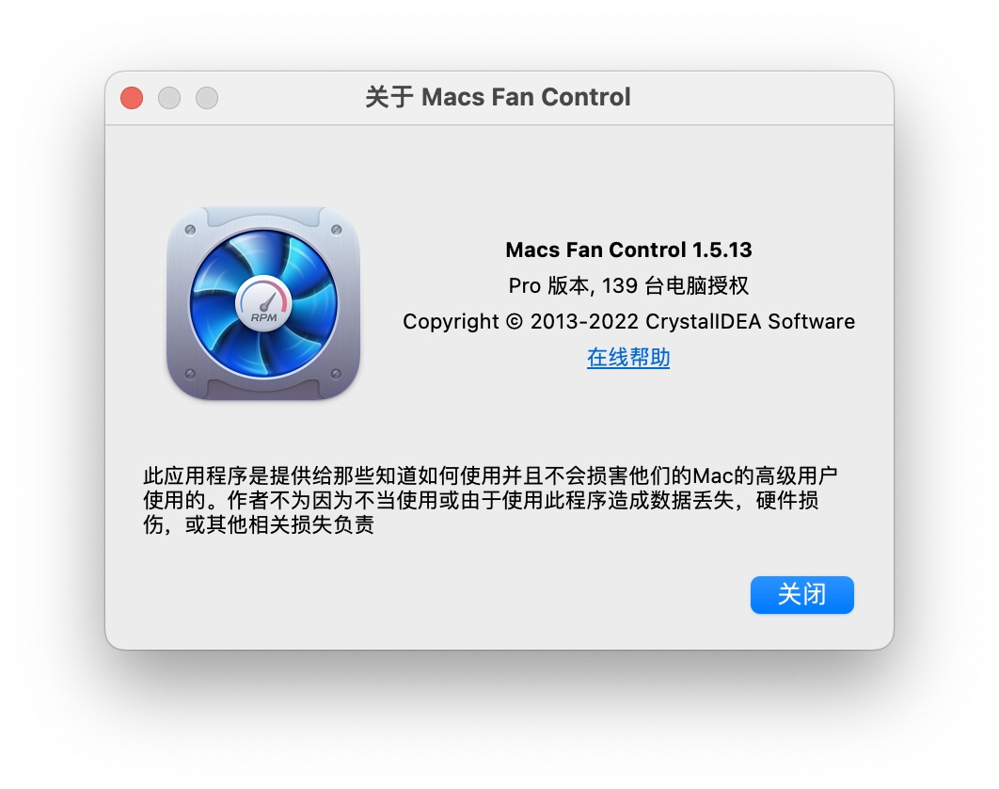

### 爆破步骤

#### 1.寻找关键点

打开.app 文件找到 MacOS 文件夹中的“Macs Fan Control”文件复制到 Downloads 备用。
打开 IDA 64 和 Hopper Disassembler，并同时载入这个二进制文件:
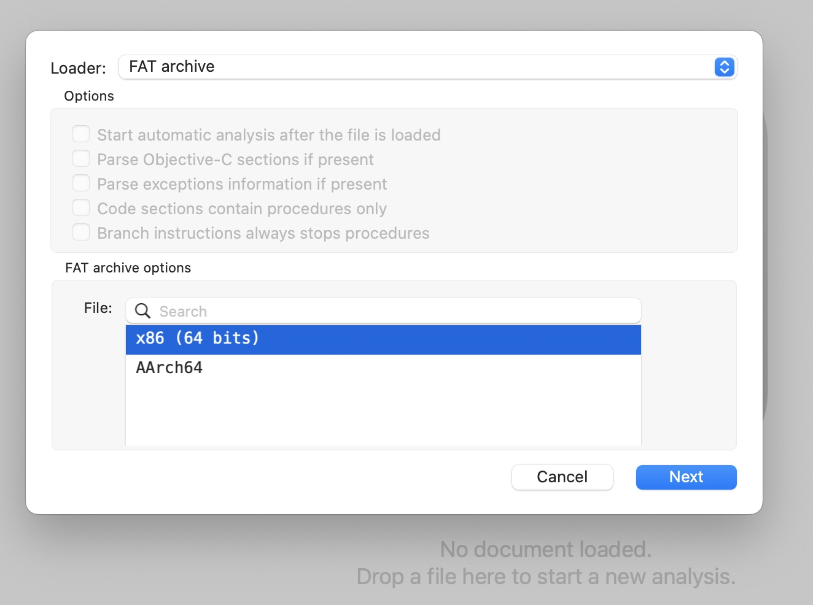
由于我是 Intel 机器，所以选“X86”，点击 Next-OK。
IDA 64 中也打开此文件：
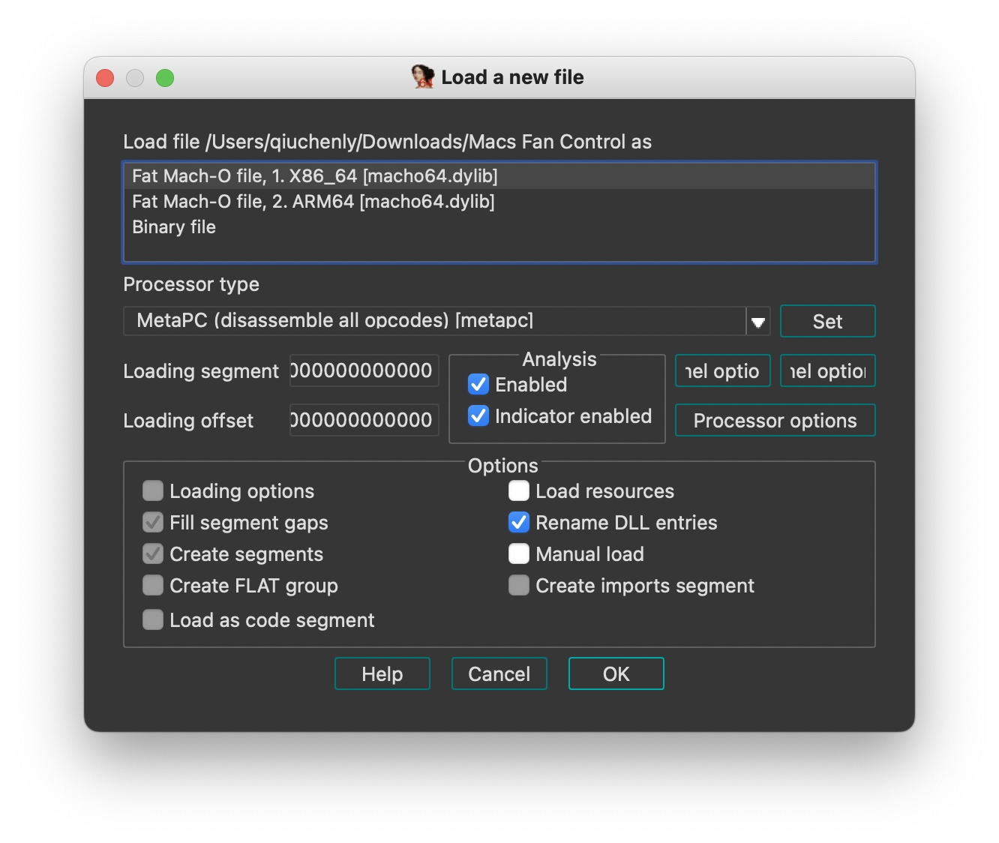
由于我是 Intel 芯片，选 X86 点击 OK 即可。
等待两分钟，这些反汇编软件会分析完二进制机器码。

#### 2.寻找破解关键点

一般查找特征关键就是看他是怎么判定是否 Pro 版本，然后爆破掉关键 check 函数即可。
这个 App 的特征就是“关于”中的显示:

由于这里不小心删掉了原始文件，所以用 Patch 过的看。
未破解版本的关于窗口可以看到有一个“免费版本”(对应 Pro 版本，xxx 电脑授权 这行字)
由于 macOS 都有全球化语言，这种字显然不会是写死 App 中，我们找一下.app 文件中“/Applications/Macs Fan Control.app/Contents/Resources/languages/Chinese_Simplified.xml”的汉化文件，看下中文对应什么 key：
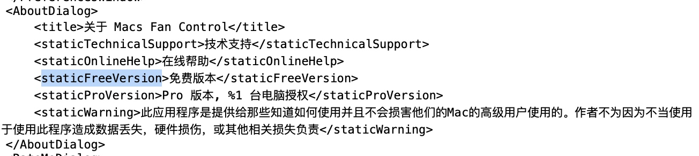
既然找到了对应的 Key，就可以在二进制里搜索了。我们去 HD 里面搜这个 key：
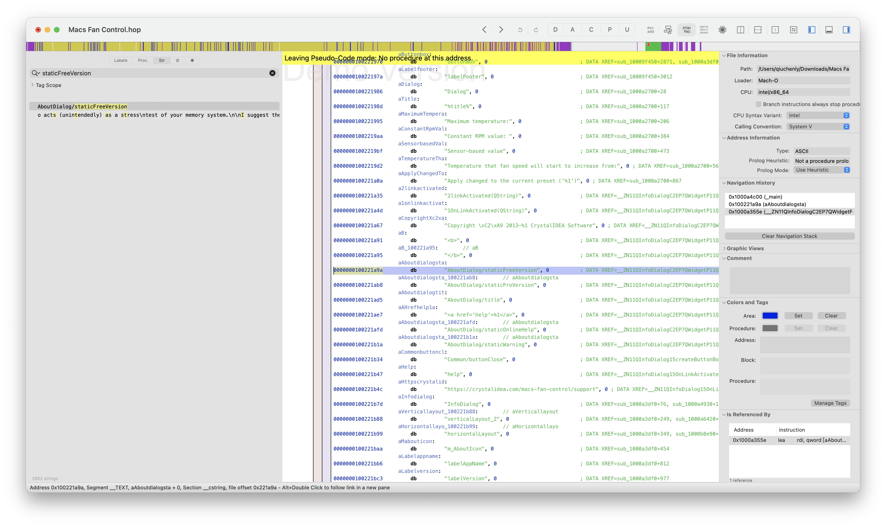
在右边按下 X 找到引用位置：
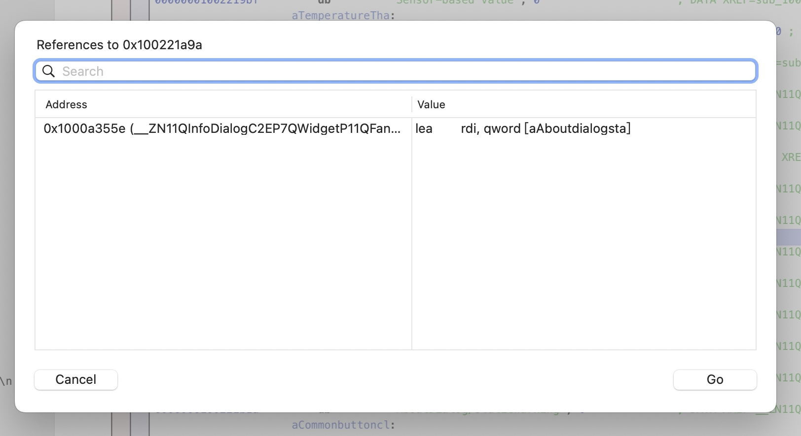
Go 过去看下：
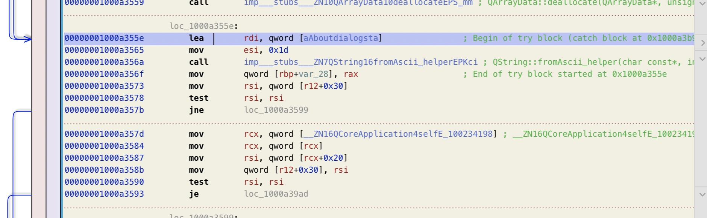
位于 1000a355e 子程序中。
看不懂反汇编没关系，我也看不懂，毕竟新手。
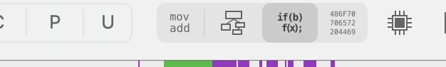
点击这个按钮，看伪代码：
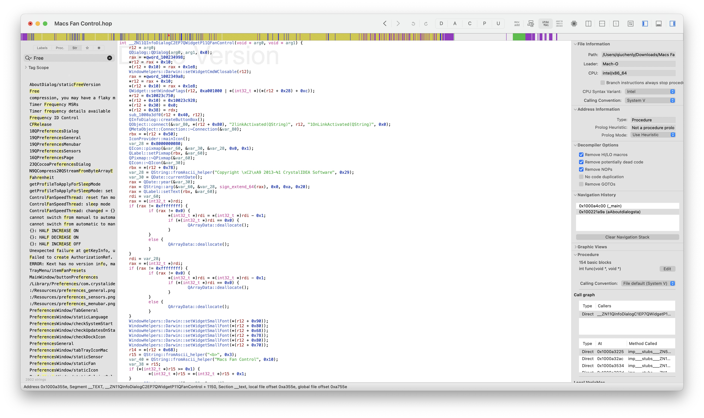
很清晰了，我们再往下翻一番：
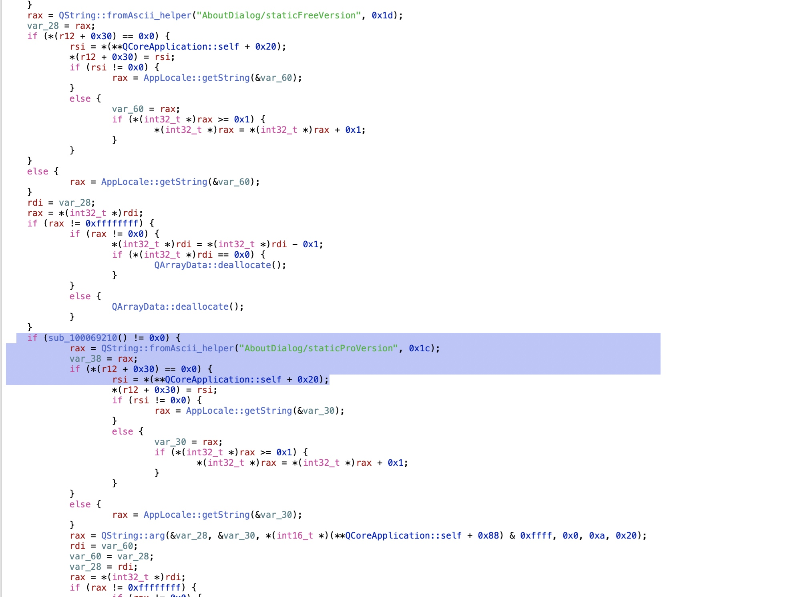
很轻松找到关键点。
可以看到在上面是默认你是 Free 版本，然后调用了一个 sub_10069210 的返回值如果不等于 0x0 即为 Pro 版本，所以我们只需要修改八个字节改成这样:
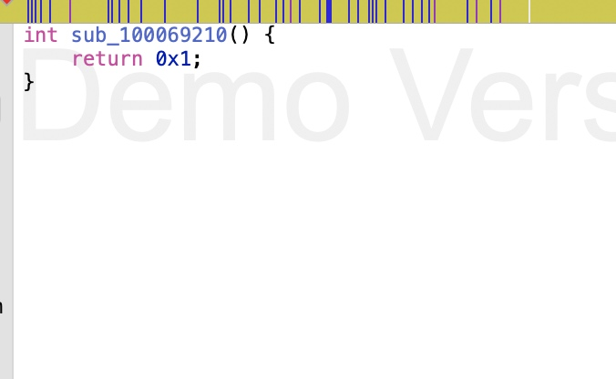
不就能是 Pro 版本了吗？试试看！
返回 IDA，跳转到 100069210 地址：
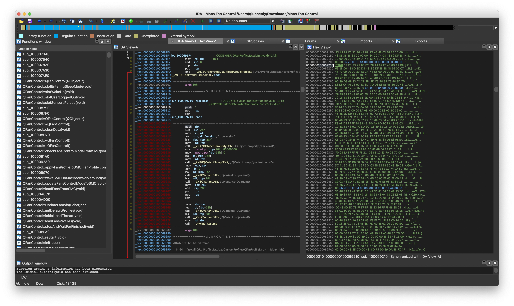
把 100069210 段开始位置的 Hex 改掉成为：6A 01 58 C3
这是我改过的文件，但是地址是一样的
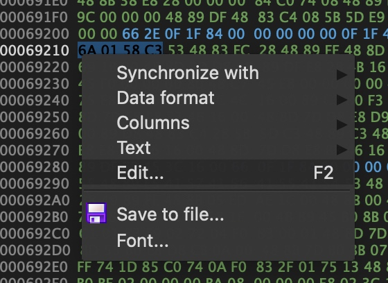
修改后右击选择“Apply changes”即可保存到内存。
然后要导出修改过的文件：
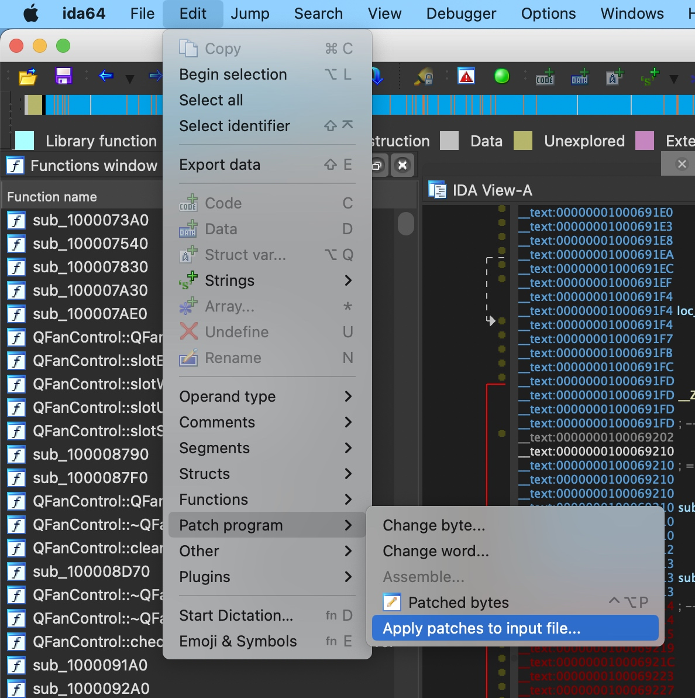
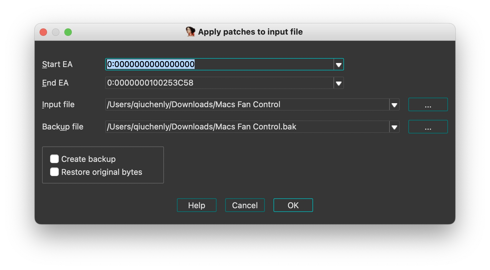
点击 OK 即可爆破完成。
最后别忘了替换掉.app 文件中的源文件并签名才可以使用哦！

#### 3.总结：

```c
if (sub_100069210(**QCoreApplication::self) != 0x0) {
            rax = QString::fromAscii_helper("AboutDialog/staticProVersion", 0x1c);
```

sub_100069210 函数返回 1 即可绕过破解 因为非 0 为真
return 1 的 X86_64 机器码为 6A 01 58 C3

### 最后

修改过的文件要替换签名，App 才能正常打开
codesign -f -s - --timestamp=none /Applications/Macs\ Fan\ Control.app/Contents/MacOS/Macs\ Fan\ Control
楼主新手第一次没经验，改完怎么都打不开，网上也没有帖子说这个事。幸好之前破解过 Parallels Desktop 18.0.3,记得要签名二进制文件.果然签完名就可以打开了.

修改过的 App 文件仅供技术研究:
https://github.com/QiuChenly/MacsFanControlCrack

有关 PD18.0.3 的文件:
https://github.com/QiuChenly/Parallels

官方文件下载：
https://crystalidea.com/macs-fan-control
